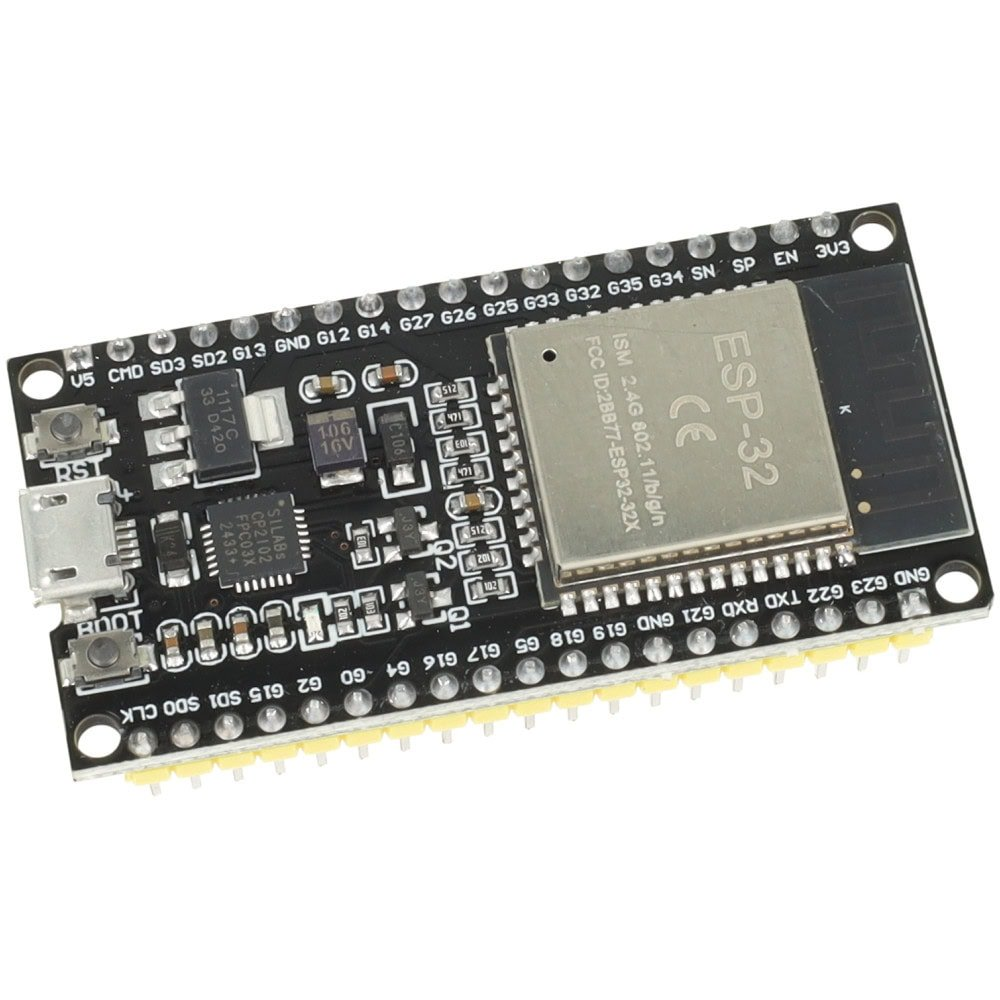
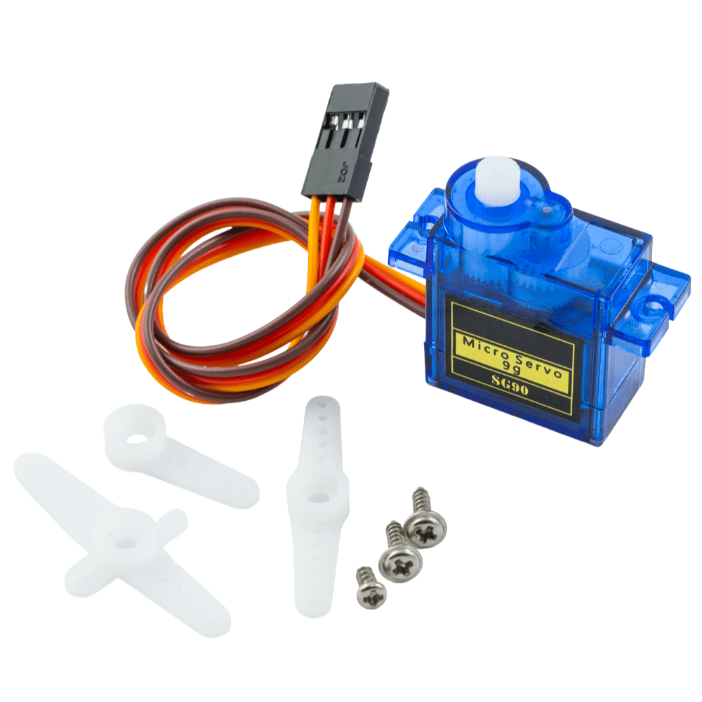
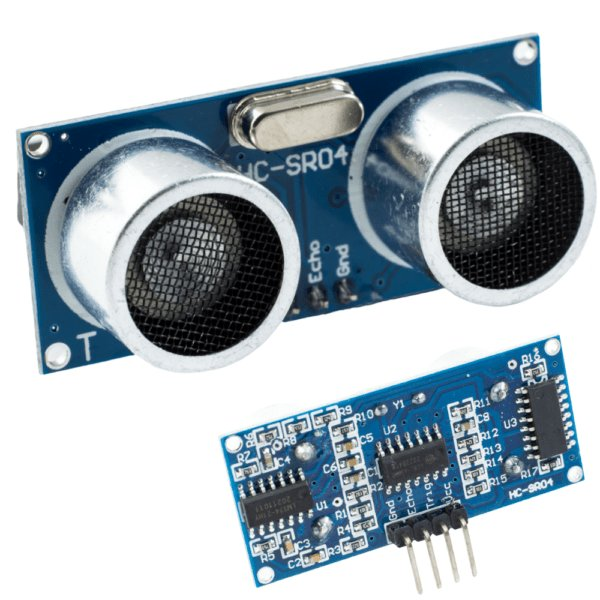
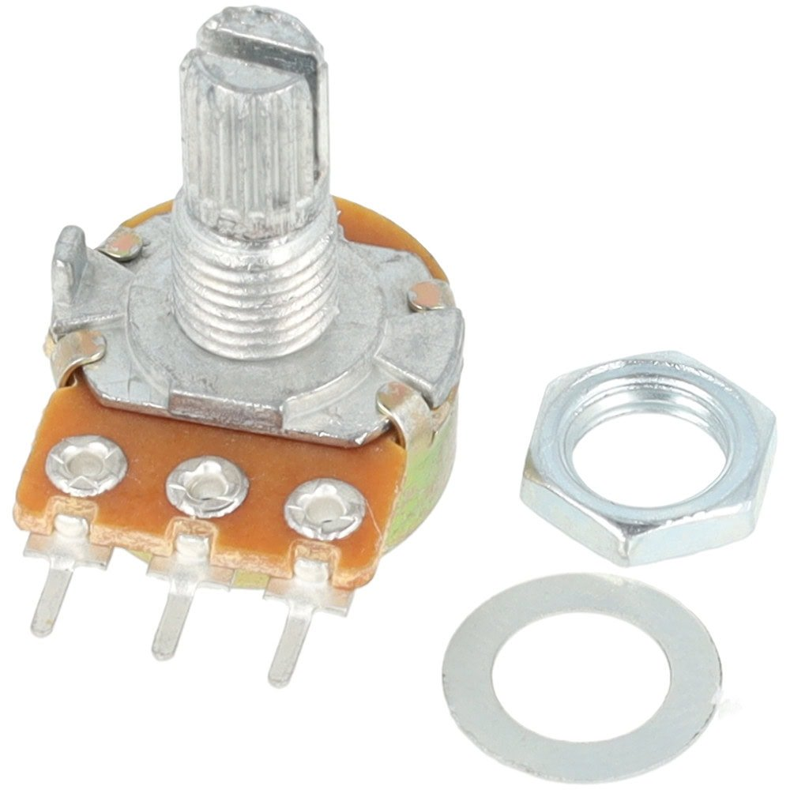
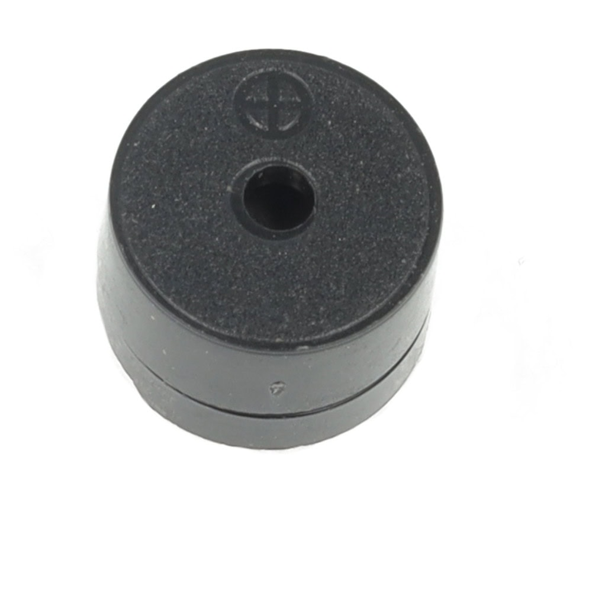
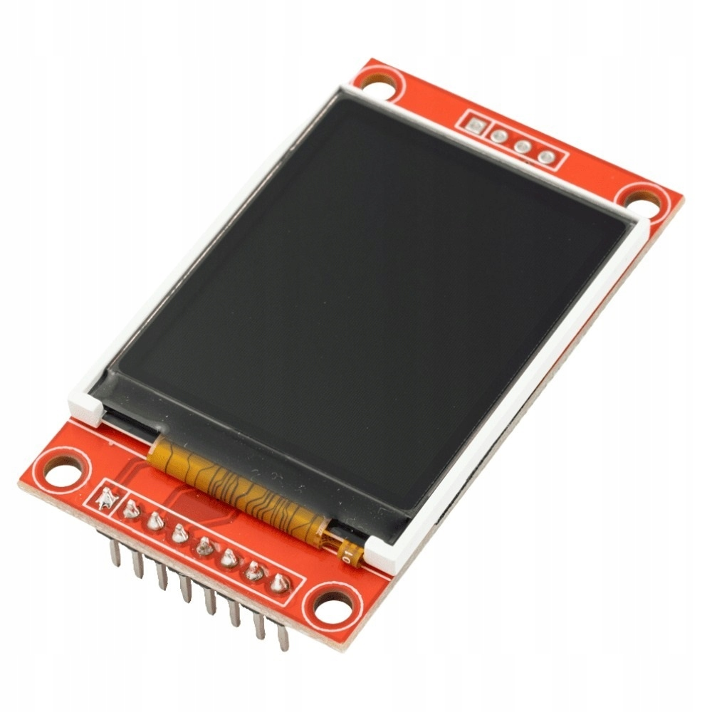

# ESP32 RadarOS 📡

## About the Project
The **RadarOS** project was created as part of a **FreeRTOS** real-time operating system course at university. Its main goal is to demonstrate multitasking, hardware management, and inter-process communication in embedded systems. 

The device works as an active radar that scans the surroundings in a 180-degree radius. The system analyzes the distance from obstacles in real time. If it detects an object closer than the set safety threshold (which the user can change dynamically), it stops scanning, starts a sound alarm, and shows notifications on the LCD screen. The whole system is based on independent tasks managed by FreeRTOS, which communicate with each other smoothly using queues and event groups.

---

## Components Used

Below is the list of hardware used to build the radar:

* **ESP32 Microcontroller** – The "brain" of the whole system, running the FreeRTOS system.
 

* **SG90 Servo Motor** – Responsible for the smooth rotation of the sensor from 0 to 180°.
 

* **HC-SR04 Ultrasonic Sensor** – Makes precise distance measurements from obstacles.
 

* **Analog Potentiometer** – Used for smooth adjustment of the alarm range threshold (from 1 cm to 100 cm).
 

* **Buzzer (Active)** – A sound indicator that informs about detecting an object in the zone.
 

* **ST7735 TFT LCD Display (128x160, SPI)** – A graphical user interface (UI) based on the LVGL library, showing the current status of the radar.
 

---

## Pinout (Hardware Connections)

All peripherals are connected to the ESP32 microcontroller according to the table below:

| Component | Component Pin | ESP32 Pin (GPIO) | Description / Function |
| :--- | :---: | :---: | :--- |
| **Servo SG90** | PWM (Signal) | `GPIO 25` | PWM signal (LEDC) controlling the rotation angle. |
| **HC-SR04** | TRIG | `GPIO 26` | Triggering the sound pulse. |
| **HC-SR04** | ECHO | `GPIO 27` | Receiving the pulse return time. |
| **Potentiometer**| OUT / Wiper | `GPIO 35` | ADC input (ADC1_CH7) to read the threshold. |
| **Buzzer** | VCC / Signal | `GPIO 33` | Digital output that triggers the alarm. |
| **LCD ST7735** | SCK / CLK | `GPIO 18` | SPI bus clock (SPI2_HOST). |
| **LCD ST7735** | SDA / MOSI | `GPIO 23` | SPI bus data line. |
| **LCD ST7735** | CS | `GPIO 5` | Chip Select. |
| **LCD ST7735** | DC / RS | `GPIO 2` | Data/Command - register selection. |
| **LCD ST7735** | RST | `GPIO 4` | Hardware reset of the screen. |
| **LCD ST7735** | BLK / LED | `3.3V` | Backlight of the panel (always on). |

*(All components are powered from 3.3V and 5V lines directly from the board or an external power source. The ground of all circuits is connected to a common GND).*

---

## ⏱️ Task Priorities

To make the system run stably as an RTOS (Real-Time Operating System), a strict hierarchy of priorities is assigned to each task (where 5 is the highest priority and 1 is the lowest):

1. **`Alarm_Buzzer.c` (Priority 5)** – Critical safety. The alarm is in a sleep state 99% of the time, but when the danger flag is raised, it must interrupt the whole system and warn the user immediately.
2. **`UltrasonicSensor.c` (Priority 4)** – Measurement precision. Distance reading is based on microseconds. To prevent other tasks from disrupting the wave return time (ECHO), the sensor must have a very high priority.
3. **`ServoMotor.c` (Priority 3)** – Smooth mechanics. The motor should move stably, but a delay of a few milliseconds does not negatively affect the radar operation.
4. **`Potentiometer.c` (Priority 2)** – HMI Interface. The ADC reading from the potentiometer is done periodically. Human reaction is much slower than processor cycles, so small delays are invisible here.
5. **`st7735_lcd.c` (Priority 1)** – Resource optimization. The LVGL graphics engine requires a lot of computing power. Rendering the interface has the lowest priority to make sure that screen drawing processes only use free CPU time and never block safety functions or sensor readings.

---

## Software Architecture (FreeRTOS)

The project is divided into modular `.c` and `.h` files, and each of them has a specific responsibility in the operating system:

* **`main.c`** – The main startup file. It initializes the communication mechanisms and starts all individual tasks.
* **`Communication.c`** – The core of data exchange in the FreeRTOS system. It contains definitions and initialization of queues (`angleQueue`, `thresholdQueue`, `distanceQueue`) and the event group (`systemEventGroup`), allowing smooth communication between hardware tasks and the screen.
* **`ServoMotor.c`** – Handles the PWM signal (using the hardware LEDC timer) for the servo motor. It has a built-in mechanism to stop the rotation immediately if the alarm flag turns on. It sends its current angle to the queue.
* **`UltrasonicSensor.c`** – Responsible for triggering and reading the distance sensor. It analyzes the measurement result against the threshold from the potentiometer. Depending on the situation, it sets or clears the `BIT_ALARM_ON` flag in the system.
* **`Potentiometer.c`** – Uses the ADC converter (OneShot) to read the voltage. It maps the raw value (0-4095) to centimeters (1-100) and sends it as the alarm threshold to the system.
* **`Alarm_Buzzer.c`** – A sleeping task that listens for events. It wakes up and makes an intermittent sound signal only when the system detects an active alarm flag, without blocking CPU resources.
* **`st7735_lcd.c`** – Manages the SPI bus and the powerful **LVGL** graphics engine. This task works as a passive data "consumer" – it asynchronously peeks (`xQueuePeek`) at values in the queues and draws the user interface in real time, using changing colors for alerts.

---

## ⚠️ Important Startup and Assembly Notes

Before you run the project on your device, pay attention to two important details:

1. **Running the logic in the code:** After cloning the repository, make sure that the lines responsible for starting the system in the `main.c` file are not commented out. For the program to work, the `init_communication();` and `allTask();` functions must be called inside `app_main()`.
2. **Sensor assembly:** According to the radar concept, the HC-SR04 ultrasonic sensor should be physically mounted on the servo motor arm (this can be done using zip ties, rubber bands, or a special 3D-printed mount). For demonstration purposes (photos/videos), to keep the connections on the breadboard clear and easy to read, the sensor and the servo motor were placed separately.

---

## 📸 Project Operation in Practice

Below is a visualization of how the system works:

